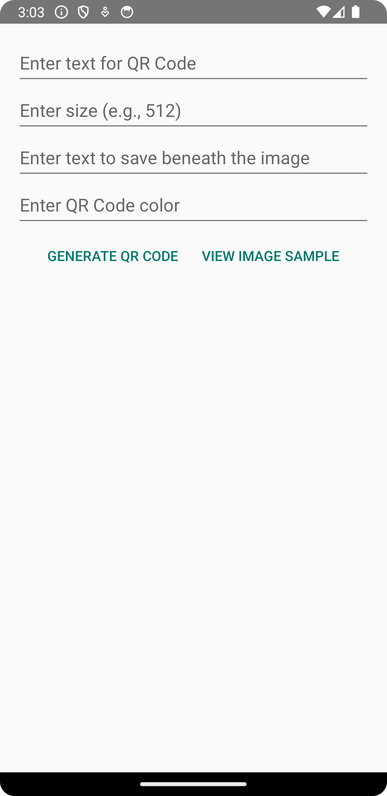
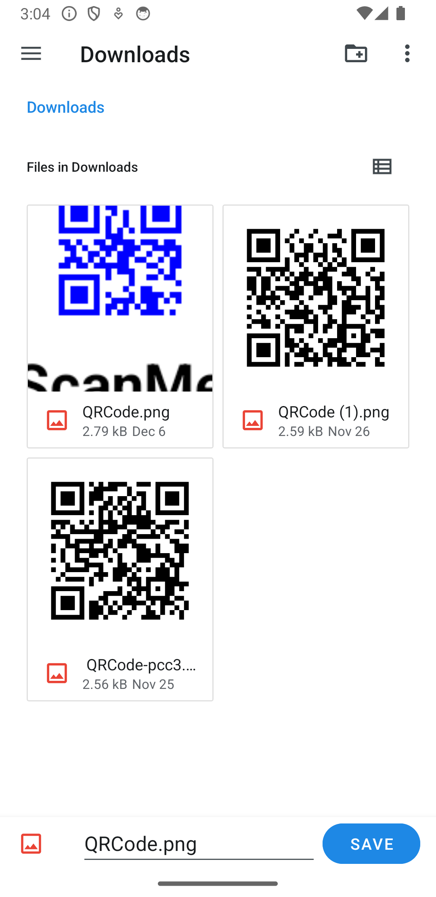
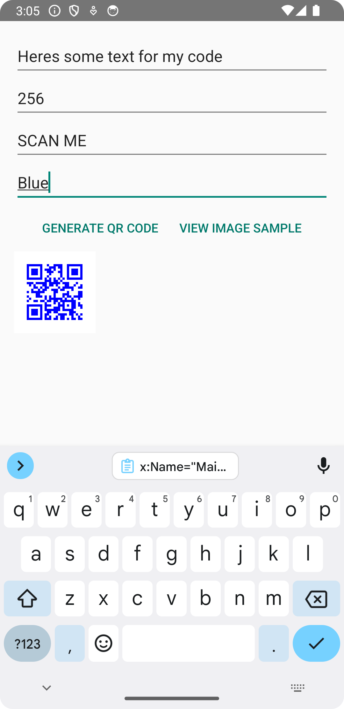

# Android QR Code Generator

[**Testers Needed Android Link**](https://play.google.com/store/apps/details?id=com.programmingtools.app)
[**Testers Needed Web Link**](https://play.google.com/apps/testing/com.programmingtools.app)

The Android QR Code Generator is a versatile app that allows users to create customized QR codes directly from their Android devices. It is perfect for various applications, including sharing URLs, contact information, or simple text in the form of a QR code.

## Technology Stack

- **Kotlin**: Developed in Kotlin, offering a modern, efficient, and safe programming experience.
- **ZXing ("Zebra Crossing") Library**: Utilized for efficient and accurate QR code generation.
- **Android SDK**: Employing the latest Android SDK versions to assure optimal compatibility and user experience.

## Features

- **Customizable QR Code Generation**: Converts user input text into QR codes with options for size and color customization.
- **User-Friendly Interface**: Designed for ease of use, providing a straightforward and intuitive user interface.
- **Save and Preview Functionality**: Users can preview the generated QR code and save it as an image on their device.
- **Additional Text Feature**: Ability to add extra text beneath the QR code for descriptive purposes.

## Getting Started

### Prerequisites

- Android Studio
- Minimum SDK version: 29

### Installation

1. Clone the repository:

   ```bash
   git clone https://github.com/thomasthaddeus/qrcode_generator.git
   ```

2. Open the project in Android Studio.
3. Synchronize the project with Gradle files.
4. Run the application on an emulator or a physical device.

## Usage

1. Enter the desired text in the input field.
2. Optionally, customize the size and color of the QR code.
3. Tap the "Generate QR Code" button to view the QR code.
4. Use the "View Image Sample" button to see a sample QR code.
5. Save the generated QR code to your device, if desired.

## Screenshots

| pic1                                               | pic2                                               | pic3                                               |
| :------------------------------------------------: | :------------------------------------------------: | :------------------------------------------------: |
|  |  |  |

## Contributing

We welcome contributions, issues, and feature requests. Feel free to check out the [issues page](https://github.com/thomasthaddeus/qrcode_generator/issues) for open issues or to suggest new features.

## License

This project is released under the Apache 2.0 License - see the [LICENSE](./LICENSE) file for details.

## Acknowledgments

- Special thanks to the ZXing ("Zebra Crossing") library for robust QR code generation capabilities.
- Grateful to all contributors and testers for their invaluable feedback and suggestions.

## Contact

Thaddeus Thomas - <thaddeus.r.thomas@gmail.com>

Project Link: [QR Code Generator](https://github.com/thomasthaddeus/qrcode_generator)
