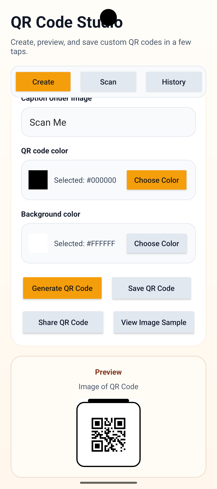
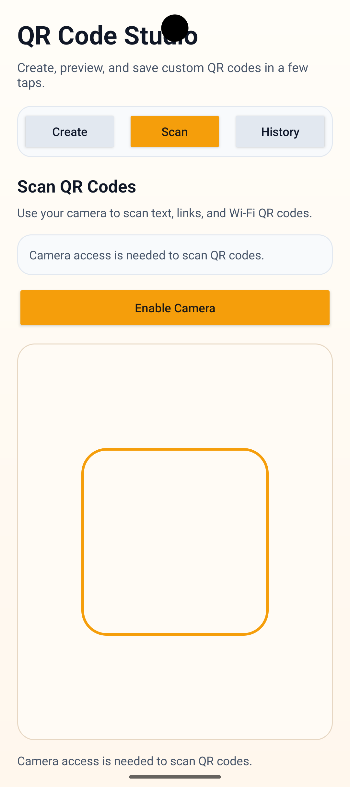
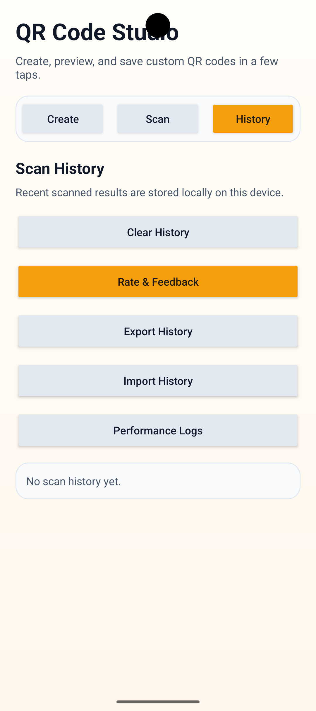

# QRCodeGenius

QRCodeGenius is an Android QR toolkit for creating, scanning, styling, saving, sharing, and organizing QR codes from one app.

Version `2.0.0` expands the app well beyond basic QR generation. It now includes live scanning, persistent history, Wi-Fi QR handling, multiple QR content types, custom design options, a home screen widget, security review flows for risky scans, dark mode, accessibility improvements, localization, and debug-only performance tracing.

## Highlights

- Generate QR codes for:
  - text
  - Wi-Fi
  - phone
  - email
  - SMS
  - location
  - contact
- Scan QR codes live with CameraX and ML Kit
- Store scan history locally with backup, export, and import support
- Share and save QR codes as `PNG`, `JPEG`, or `WEBP`
- Customize QR appearance with:
  - foreground and background colors
  - design presets
  - finder eye styles
  - center badges
  - optional center logo
- Use a home screen widget to generate a quick QR from clipboard text
- Review suspicious links, risky phone/SMS payloads, and weaker Wi-Fi networks before acting on them
- Use the app in light or dark mode
- Access Spanish localization and stronger accessibility support

## Screenshots

| Create | Scan | History |
| :----: | :--: | :-----: |
|  |  |  |

## Tech Stack

- Kotlin
- Android SDK
- ZXing
- CameraX
- Google ML Kit Barcode Scanning
- AndroidX AppCompat / Activity / Lifecycle

## Getting Started

### Requirements

- Android Studio
- Android SDK Platform 36
- JDK 17

### Run Locally

1. Clone the repository:

```bash
git clone https://github.com/thomasthaddeus/QRCodeGenius.git
```

1. Open `QRCodeGenius` in Android Studio.
2. Let Gradle sync.
3. Run the app on an emulator or Android device.

## Project Structure

- `app/src/main/java/programmingtools`
  Main Android app code
- `app/src/main/res`
  Layouts, strings, themes, widget config, and backup rules
- `.github/workflows`
  CI, lint, release, dependency, and wrapper validation workflows
- `docs/performance-benchmarking.md`
  Notes for the recent performance pass
- `CHANGELOG.md`
  Release history and major changes

## Release Notes

See [CHANGELOG.md](./CHANGELOG.md) for the current release history and [docs/release-notes-2.0.0.md](./docs/release-notes-2.0.0.md) for the prepared `v2.0.0` release notes.

## Contributing

Issues, bug reports, and feature ideas are welcome through the [issue tracker](https://github.com/thomasthaddeus/QRCodeGenius/issues).

## License

Released under the Apache 2.0 License. See [LICENSE](./LICENSE).
